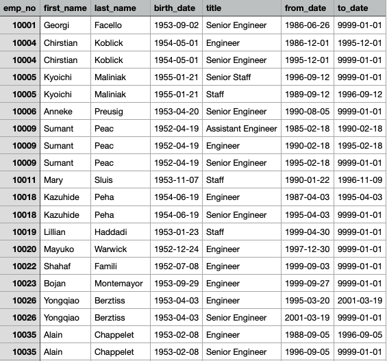
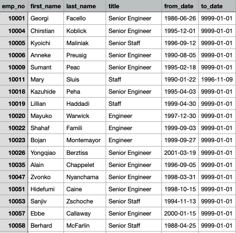
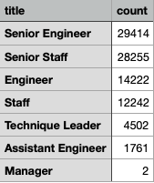

# Pewlett-Hackard-Analysis
## Purpose: Use SQL to help the HR analysis to find who will retire in the next few year and which position will be available. This will help the company to generate who is eligible for the retirement package. 

## Results:.
Retirement_titles:

Unique_titles:

Retiring_titles:

Mentorship_eligibility:

