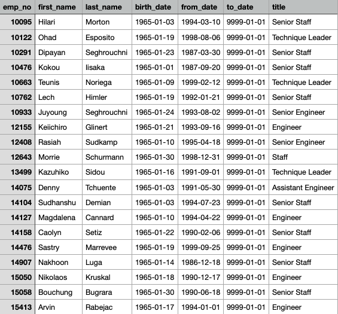

# Pewlett-Hackard-Analysis
## Purpose: 
Use SQL to help the HR analysis to find who will retire in the next few years and which position will be available. This will help the company to generate who is eligible for the retirement package. 

## Results:.
Retirement_titles:

Unique_titles:

Retiring_titles:

Mentorship_eligibility:

## Summary:
Based on the retirement titles: the company should be preparing for these roles: senior engineer, senior staff, engineer, staff, technique leader, assistant engineer, manager. There will be 7 roles available in the next few years. 

